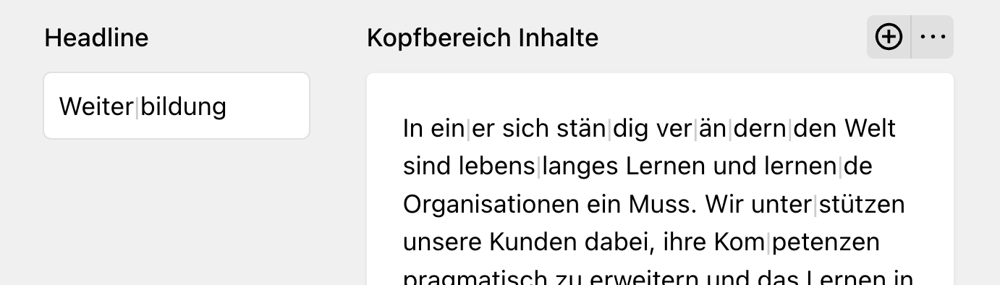

# Kirby Soft Hyphens

Render visible soft hyphens `&shy;` in [k-writer](https://getkirby.com/docs/reference/panel/fields/writer) fields. 

Can be used in combination with [Kirby Hidden Characters](https://github.com/grommasdietz/kirby-hidden-characters). That plugin adds a custom font to render (normally invisible) characters like spaces, line breaks, etc.

Unfortunately most applications (like modern browsers) will not make use of the glyph that is provided for the (control character) soft hyphen.



This plugin adds visual markers by appending them to soft hyphens in writer fields when they are mounted. The markers are wrapped in a custom `<shy>` tag. 

(This tag will not be stored back to the content.txt as it's not on the allowed tags list of ProseMirror. So the highlight is only visible in the panel.) 

## Installation

```
composer require toto/kirby-soft-hyphens
```

## Upcoming features / ideas

- [ ] Add custom writer mark to add a soft hyphen to the text.
